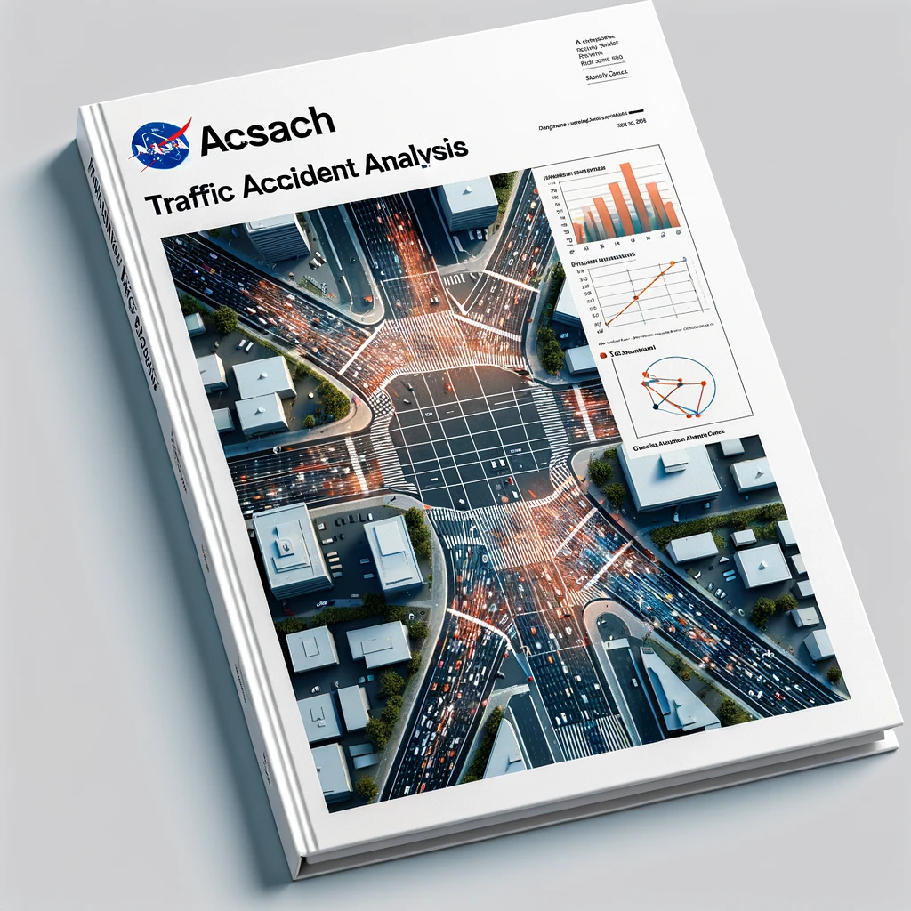

# Research Project Synopsis: #

### ***Utilized: Python (NumPy & Pandas), JSON, data cleaning, and graph analysis***

### ***To: Produce descriptive, exploratory, inferential, and predictive data analyses***

### ***For: The impact of external factors on traffic accidents, the extent of delays caused, and correlations to population density***

